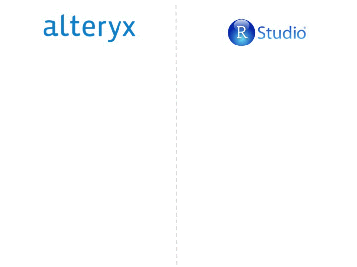
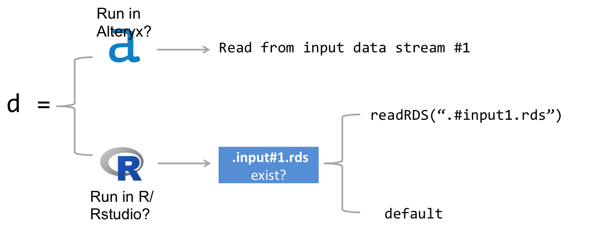

# AlteryxRhelper

This package provides functions that allows Alteryx users to write, test and manage R code in their workflows, outside of Alteryx, in an IDE like RStudio. 

<div style='text-align:center'>
  </img>
</div>

You can install the package from github.

```r
devtools::install_github("AlteryxLabs/AlteryxRhelper")
```

## Quick Start

Let us start by scaffolding a sample workflow, extracting the embedded R code, editing it in an IDE, and updating the workflow, all without leaving the confines of your favorite IDE.


```r
library(AlteryxRhelper)
scaffoldWorkflow(outDir = 'test')
```

This function

1. creates a directory named `test`
2. copies a default macro template from `AlteryxRhelper` into `test/mymacro.yxmc`
3. extracts R code from the macro and saves it as `test/rmacro1.R`.
4. opens `test/rmacro1.R` for editing.

The R code in `test/mymacro1.R` has been written carefully so that it will run without any errors even outside of Alteryx. You can read more about this in the section on [Writing Portable Code](#portable)

You can now go ahead and edit the contents of `test/mymacro1.R`. When you are done editing, you can update the macro by running

```r
insertRcode('mymacro.yxmc', 'mymacro1.R`)
```


### Writing Portable Code

Often times, you might find yourself in a situation where you want to run some R code from an Alteryx workflow in RStudio. You could copy-paste the code from the workflow or alternately, use `extractRCode` to extract and save it to file. 

If you now try to execute the extracted code in an R session outside of Alteryx, it is most likely to throw an error. Why does that happen? Why does it run fine inside an Alteryx workflow, but errors out when run in an R session outside? There are two primary reasons for this:

1. Alteryx workflows (especially macros), use interface (UI) tools to receive input from the users at runtime.  These inputs can be referenced by name, inside the R tool as `%Question.variablename%`. At runtime, a preprocessor replaces these references with their actual values, before executing the code.

2. Alteryx workflows pass data around from node to node. The R tool can read data from an Alteryx input stream using `d <- read.Alteryx("#1", mode = 'data.frame')`. This line of code reads the contents of input stream "#1" and assigns it to the variable `d`. All this happens at runtime.

Since the input variables and data streams exist only at runtime inside an Alteryx workflow, any code that makes use of these will throw errors when run outside of Alteryx. The trick to solving this problem is to follow a small set of conventions that will make your R code portable across Alteryx and other R editors.

### Input Streams

We use `read.Alteryx` to read data into R from an Alteryx input stream. We can make this code portable by making use of `read.Alteryx2`, and supplying it with `default` data.

```r
d <- read.Alteryx2('#1', default = data.frame(x = 1:10))
```

The `read.Alteryx2` function operates differently depending on the compute context. Inside an Alteryx workflow, it simply calls `read.Alteryx` under the hood. Outside an Alteryx workflow, it first looks for a file named `.input#1.rds` in the current workflow directory. This file should exist if the workflow was run prior to popping it open into your IDE, since `read.Alteryx2` creates it everytime the workflow is run. If this file doesn’t exist, it will use the value provided by the default argument. 

If you always run the workflow prior to executing the R code in an R console, you can avoid providing a `default`, since the first run would create an `rds` file that can then be read by R during subsequent runs. However, I always find it useful to specify a `default`, even when this is the case.

<div style='text-align:center'>
  </img>
</div>

### Question Inputs

This package provides helper functions that let you read different types of questions inputs, and assign them to an R object.

```r
input <- list(
  breaks = numericInput("%Question.breaks%", default = 5),
  color = textInput("%Question.color%", default = "steelblue")
)
```

1. numericInput
2. textInput
3. dropdownInput
4. listInput
5. checkboxInput
6. radioInput
7. selectInput

### Question Input Example

Some additional inputs have been added to handle common design patterns. Suppose, you have a radio input that lets users choose between three distributions.

```r
if ("%Question.dist.normal%" == "True"){
  # do something
} else if ("%Question.dist.uniform%" == "True"){
  # do something
} else if ("%Question.dist.exp%" == "True"){
  # do something
}
```

With this package, you can use the `findTrueInput` function

```r
input <- list(
  dist.normal = radioInput("%Question.normal%", TRUE),
  dist.uniform = radioInput("%Question.uniform%"),
  dist.exponential = radioInput("%Question.exp%")
)
input$dist <- findTrueInput(input, 'dist')
```

### Auto Extract Question Inputs

This is an experimental feature that allows automatic extraction of question inputs from an Alteryx workflow and inserting it into the R Code. To test this feature, let us edit `mymacro1.R` so as to remove the lines that contain the question inputs.

Your `mymacro1.R` file should now be

```r
# read data
d <- read.Alteryx2("#1", default = data.frame(x = 1:10))
# write data to output 1
write.Alteryx2(d, 1)

# write graph to output 3
AlteryxGraph2({hist(d$x, breaks = input$breaks, col = input$color)}, 3)
```

Let us insert this R code back into the macro

```r
insertRcode('mymacro1.yxmc', 'mymacro1.R')
```


Now, let us run the `extractMacro` function. This time around, we pass it an extra argument named `extractInput`, which extracts all question inputs, and generates the necessary code that would convert them into R objects and assign them to a list object with the specified name.

```r
extractRcode('rmacro.yxmc', extractInput = 'input')
```

You will notice that the following lines automatically got appended to the extracted `rmacro1.R`.

```r
## DO NOT MODIFY: Auto Inserted by AlteryxRhelper ----
library(AlteryxRhelper)
input <- list(
  breaks = numericInput('%Question.breaks%' , 5),
  color = textInput('%Question.color%' , 'steelblue'),
  debug = checkboxInput('%Question.debug%' , FALSE)
)
options(alteryx.wd = '%Engine.WorkflowDirectory%')
options(alteryx.debug = input$debug)
##----
```


